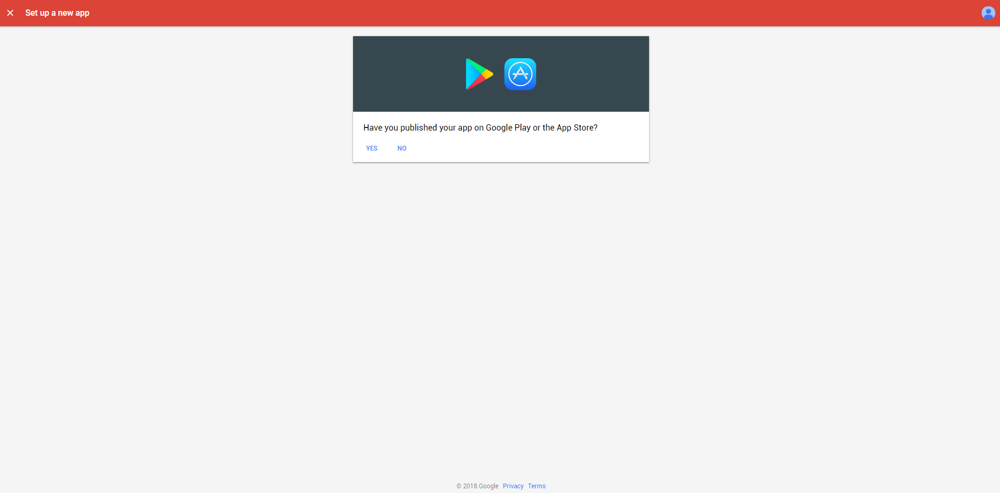
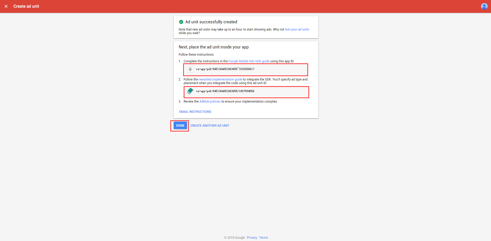
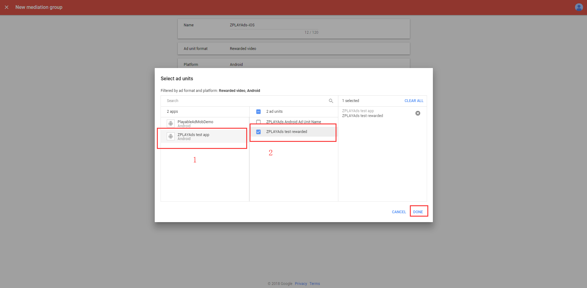
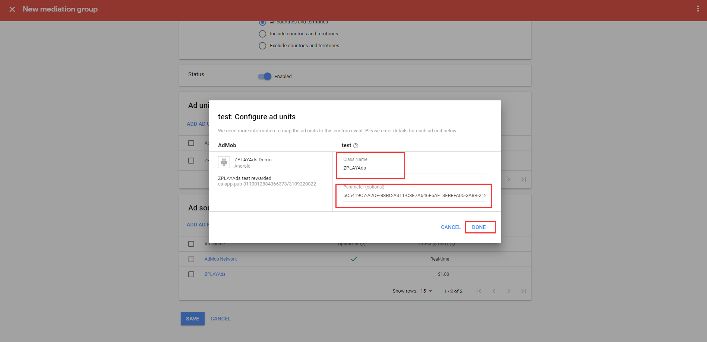

- [1 Integrate ZPLAY Ads SDK and AdMob SDK](#1-integrate-zplay-ads-sdk-and-admob-sdk)
    - [1.1 Add ZPLAY Ads SDK Dependence](#11-add-zplay-ads-sdk-dependence)
    - [1.2 Add AdMob Ads SDK Dependence](#12-add-admob-ads-sdk-dependence)
    - [1.3 Import ZPLAY Ads Adapter into project](#13-import-zplay-ads-adapter-into-project)
- [2 Add ZPLAY Ads as a New Network on AdMob](#2-add-zplay-ads-as-a-new-network-on-admob)
    - [2.1 Add New App](#21-add-new-app)
    - [2.2 Add New Ad Unit](#22-add-new-ad-unit)
    - [2.3 Add ZPLAY Ads as a New Network on AdMob](#23-add-zplay-ads-as-a-new-network-on-admob)

## 1 Integrate ZPLAY Ads SDK and AdMob SDK
Using Android Studio as an example, here are some major steps. Please refer to [AdMob SDK Integration Guide](https://developers.google.com/admob/android/quick-start) when integrate AdMob.

### 1.1 Add ZPLAY Ads SDK Dependence

Add ZPLAY Ads dependence in app Module:

```
dependencies {
    compile 'com.playableads:playableads:2.2.1'
}
```

### 1.2 Add AdMob Ads SDK Dependence

a. Add maven repository in the build.gradle, which locates in the root directory:

```
maven {
    url "https://maven.google.com"
}
```
And make it look like follows:
```
allprojects {
    repositories {
        maven {
            url "https://maven.google.com"
        }
    }
}
```
b. Add Admob dependence in app Module
```
dependencies {
    compile 'com.google.android.gms:play-services-ads:15.0.1'
}
```

About integrating of AdMob, please refers to [Official Documentation](https://developers.google.com/admob/android/quick-start#import_the_mobile_ads_sdk)

### 1.3 Import ZPLAY Ads Adapter into project 

Rewarded Video Adapter：[ZPLAYAdsAdMobAdapter.java](./app/src/main/java/com/zplay/playable/playableadmobdemo/ZPLAYAdsAdMobAdapter.java)

Interstitial Adapter：[ZPLAYAdsAdMobInterstitialAdapter.java](./app/src/main/java/com/zplay/playable/playableadmobdemo/ZPLAYAdsAdMobInterstitialAdapter.java)

> If you want to know more about Adapter and Request, please refer to the code sample in DEMO.

## 2 Add ZPLAY Ads as a New Network on [AdMob](https://apps.admob.com/v2/home)

#### 2.1 Add New App

a. Click "Apps" in the menu bar, and then click "ADD APP" button. 


b. Choose whether your app has published in Google Play or App Store. If your App has been published in Google Play or App Store, choose "YES", otherwise choose "NO", here take unpublished as an example.


c. Enter your app information and choose a platform, and click "ADD" to add an app.


#### 2.2 Add New Ad Unit

a. After you add an App, click "NEXT: CREATE AD UNIT" button to create an ad unit for this App


b. Choose an ad format. ZPLAY Ads supports Interstitial and Rewarded now. Using Rewarded as an example. 


c. Fill in the name of Ad unit, then click "CREATE AD UNIT" to add ad unit.


d. Get app ID and ad unit ID of this ad unit. Click "DONE" to accomplish ad unit creation.


#### 2.3 Add ZPLAY Ads as a New Network on AdMob
a. Choose "[Mediation](https://apps.admob.com/v2/mediation/groups/list)" in the menu bar, and click "CREATE MEDIATION GROUP" button.


b. Choose ad format and platform. ZPLAY Ads supports Interstitial and Rewarded video now. Here take Rewarded video as an example. Click "CONTINUE" button to go on.


c. Fill in the name of Mediation and select locations to target. Mediation is only available when the status is Enabled, please make sure that status is Enabled. Click "ADD AD UNITS" to choose ad unit. 


d. Choose the app and ad unit you want to configure in the selection box, and click "DONE" to complete configuration.


e. Click "ADD CUSTOM EVENT" to add custom ad sources.


f. Fill in the label of custom ad resource, using ZPLAYAds as an example, you can customize it and set floor price according to your needs. 


g. Configure ZPLAY Ads ad source. Fill in full adapter class name in "Class Name" (as the following image shows, the class name in the picture is just a sample, please use the following adapter name), the Interstitial adapter name in demo is `com.zplay.playable.playableadmobdemo.ZPLAYAdsAdMobInterstitialAdapter`, and Rewarded Video adapter name in demo is `com.zplay.playable.playableadmobdemo.ZPLAYAdsAdMobAdapter`. There are should be two values separated by blank in "Parameter", the first one is the [App ID](https://sellers.zplayads.com/#/app/appList/) and the second one is the [Ad Unit ID](https://sellers.zplayads.com/#/ad/placeList/), which you applied on ZPLAY Ads. Please note that the order of these two values cannot be changed. Click "DONE" to complete configuration.


Note: You are available to use the following ID when testing your App (no charge). Please replace them with the ID you applied in [ZPLAY Ads](https://sellers.zplayads.com/) when you publish your App.

|Ad Format|App_ID|Ad_Unit_id|
|---|---|---|
|Rewarded|5C5419C7-A2DE-88BC-A311-C3E7A646F6AF|3FBEFA05-3A8B-2122-24C7-A87D0BC9FEEC|
|Interstitial|5C5419C7-A2DE-88BC-A311-C3E7A646F6AF|19393189-C4EB-3886-60B9-13B39407064E|

h. You can see ZPLAY Ads in Ad sources list. Click "SAVE" to complete ZPLAYAds configuration.


i. Check whether third-party ad source has been added successfully. In the [Apps list](https://sellers.zplayads.com/#/app/appList/), find the application and ad unit selected in step d. The active number in the "mediation groups" increased, indicating that the ad source is successfully configured.

